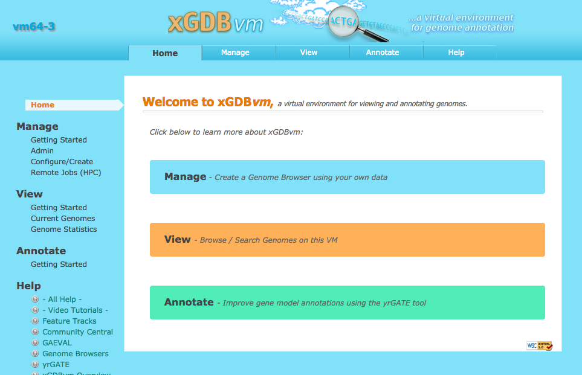

# Case study: Rapid Setup of an Analysis Environment for Comparative *Polistes* Genomics

Contributed by Daniel Standage, February 2016.

During our recently work on assembling and annotating the genome of the paper wasp *Polistes dominula*, the genome of its cogener *P. canadensis* became available.
Here we demonstrate how **xGDBvm** can be used for rapid setup of an environment for visualizing the genome, as well as evaluating and refining annotations for genes of interest.

## 1. Machine setup

From the Atmosphere portal, launch a new *virtual machine (VM)* instance using the latest xGDBvm image (**xGDBvm-v1.15 19 Feb 2016** as of this writing).
For this case study, we will rely completely on the VM's local storage and the iPlant/CyVerse data store, so a *medium-* or *large-* sized instance is preferred.

Once the VM is accessible—indicated by a green light icon in the Atmosphere portal—the next step is to complete the configuration procedure.
Note the VM's IP address in the portal: this will be necessary for establishing a remote terminal connection now and for accessing xGDBvm over the Web later.

Instructions for the configuration procedure can be seen by connecting to the VM via SSH and executing the `quickstart` command in your terminal.
The `instructions` command is also available and provides additional detail if you run into any issues.
Note that several of these steps will involve entering either your iPlant/CyVerse password, or creating a new password for accessing xGDBvm over the Web.

```bash
# quickstart procedure
update-vm
setup-vm
iinit
mount-datastore
configure-vm
```

Barring any errors, you should now be able to paste the VM's IP address in your Web browser and access the xGDBvm Web interface.
Because the VMs use self-signed security certificates, you may need to reassure your web browser that everything is ok and to ignore any related security warnings it raises.
You will also need to enter the username (default: user) and password that you set while running the setup process.

This should bring up the xGDBvm home page, which looks like this.
If this is your first time using xGDBvm, you may want to try one of the small example data sets (*Manage -> Configure/Create -> Configure New GDB -> EXAMPLE DATASETS*) to familiarize yourself with xGDBvm's configuration screen.



## 2. Data access

For this case study, we will be using the following data.

- Genome sequence (assembled scaffolds) of the *P. canadensis* genome, as made available by colleagues [here](http://wasp.crg.eu/download.html).
- Transcript shotgun assemblies from four *Polistes* species, as available from the NCBI TSA database.
  Download link annotated as the final `TSA` entry of the record.
    - [*P. canadensis*](http://www.ncbi.nlm.nih.gov/nuccore/GAFR00000000.1)
    - [*P. dominula*](http://www.ncbi.nlm.nih.gov/nuccore/GEDB00000000.1)
    - [*P. fuscatus*](http://www.ncbi.nlm.nih.gov/nuccore/GDFS00000000.1)
    - [*P. metricus*](http://www.ncbi.nlm.nih.gov/nuccore/GDHQ00000000.1)
- Reference proteins obtained from RefSeq entries of the following species.
    - *Apis mellifera* (honey bee)
    - *Drosophila melanogaster* (fruit fly)
    - *Nasonia vitripennis* (jewel wasp)

The `data_commands.sh` script is provided with xGDBvm to facilitate easy download of these data.
After successful set up of the VM, execute the following commands in the terminal to download the data files.

```bash
# Create a dedicated directory for our input data
mkdir ~/pcan-gdb/
cd ~/pcan-gdb/

# Load the data download helper commands
source /xGDBvm/case-studies/Polistes/data_commands.sh

# Now download the data
download_genome
download_refrprot
download_tsa GAFR01.1 Pcan
download_tsa GEDB01.1 Pdom
download_tsa GDFS01.1 Pfus
download_tsa GDHQ01.1 Pmet

# Move the data over to the iPlant data store
# This will take several minutes
cd /xGDBvm/input/xgdbvm/
mv ~/pcan-gdb/ /xGDBvm/input/xgdbvm/
```

These commands should create nine data files in the VM's `/xGDBvm/input/xgdbvm/pcan/` directory.

- `Pcan.gdna.fa`: genome sequence
- `Pcan.annot.fa`: genome annotation
- `Amel.refrprot.fa`: reference proteins (bee)
- `Dmel.refrprot.fa`: reference proteins (fly)
- `Nvit.refrprot.fa`: reference proteins (wasp)
- `Pcan.tsa.fa`: *P. canadensis* transcripts
- `Pdom.tsa.fa`: *P. dominula* transcripts
- `Pfus.tsa.fa`: *P. fuscatus* transcripts
- `Pmet.tsa.fa`: *P. metricus* transcripts

## 3. Configuring the GDB

Back in the Web browser, using the navigation bar at the top of the page to configure a new GDB: select *Manage -> Configure/Create -> Configure New GDB*.
Enter the following information.

- something like "PcanGDB" for the unique database name
- "*Polistes canadensis*" for the organism
- "red paper wasp" for the common name
- select `/xGDBvm/input/xgdbvm/pcan-gdb` for input data
- under "Transcript Spliced Alignment", select "Remote" compute resources, "Arabidopsis" as the species model, and "Strict" alignment stringency
- under "Protein Spliced Alignment", select "Remote" compute resources and "arabidopsis" as the species model

Click the `Save New` button to save the GDB configuration.
This will not actually create the GDB, but will store the settings necessary to create it.
The GDB should have its status set to "Development" (light grey), and in this state you can continue to edit the GDB configuration should the need ever arise.

## 4. Validating input files

When you are ready to actually create the GDB, click on the orange `Data Process Options` button and then click the `Validate Input Data Files` button to run a few sanity checks on the input data.
During the validation process, the GDB's status will be set to `Locked` (purple), and you will be unable to edit the configuration or launch any additional processing.
You can monitor the status of the validation process from the configuration list by clicking *Configure/Create -> List All Configured*.
The status will return to `Development` (light grey) when the validation is complete.
At this point you can return to the configuration page by clicking the appropriate cog in the configuration list.

## 5. HPC access

When we initially configured the GDB, we requested remote compute resources for transcript and protein spliced alignments.
Computing these alignments on remote high-performance computers, rather than locally on the VM, should dramatically speed up the processing.
We need to provide our username and password to authenticate with these HPC resources before the launching the final GDB creation steps.

You can access the authentication page by clicking *Manage -> Remote Jobs -> Authenticate User.*
Provide your iPlant/CyVerse username and password to get authorization keys, and then again to log in to the HPC.
Authorization keys need only be obtained once for each VM, but each HPC log in lasts only 4 hours and must be renewed to submit additional HPC jobs later.

## 6. Create the GDB

So far, we have done the following.

- Set up the VM
- Downloaded our case study data
- Validated the data within xGDBvm
- Authenticated with HPC resources

Having successfully completed all these steps, we are now ready to create the GDB.
From the GDB configuration page, click the orange `Data Process Options` button again, and then click `Create GDB`.
This will initiate the process to compute transcript and protein alignments and populate the database with the genome sequence and annotations provided.
Again, progress can be monitored from the configuration listing page, and the status will be set to `Complete` (blue) when all steps have completed.

At this point, xGDBvm is ready for action.
You can search for gene models, transcripts, or reference proteins by ID; alternatively, you can use BLAST search against the scaffolds or gene model translations to identify homologs of genes of interest; and you can (re-annotate) gene models of interest using the yrGATE Web annotation plaform.
